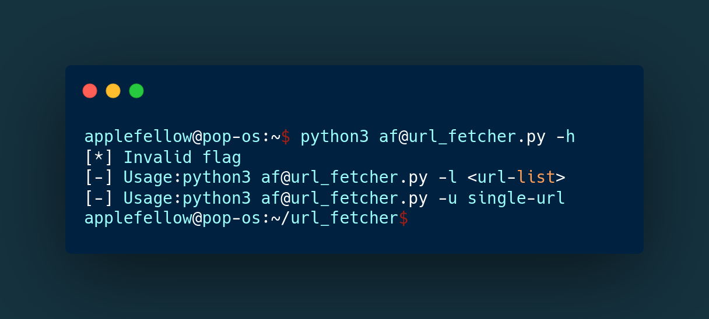

# URL_fetcher
-------------

Url_fetcher is a python3 tool to fetch all the urls from given url or url list's.<br/>
eg: python3 af@url_fetcher.py -u https://www.google.com<br/>
eg: python3 af@url_fetcher.py -l urls.txt (This file contains bulk amount of urls)<br/>
This tool is developed in python3. it uses threads for fast scan.The tool finding url's from the source code of the given website url.<br />
url_fetcher has currently only 3 flags '-u' for single target and '-l' for target list and '-h' for help.<br/>
updation will be available in future.<br/> 




# Installation
python
------
need python3 

```sh
▶ sudo apt update
▶ sudo apt install software-properties-common
▶ sudo add-apt-repository ppa:deadsnakes/ppa
▶ sudo apt update
▶ sudo apt install python3.8
```
that's it... finally check with 'python --version'

pip3
----
```sh
▶ sudo apt install python3-pip
▶ pip3 --version
```
Requirements
------------
```sh
▶ pip3 install -r requirements.txt
```
